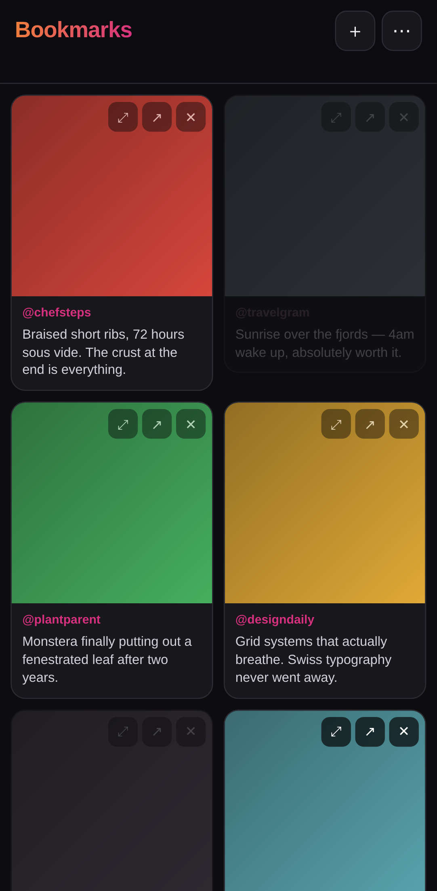
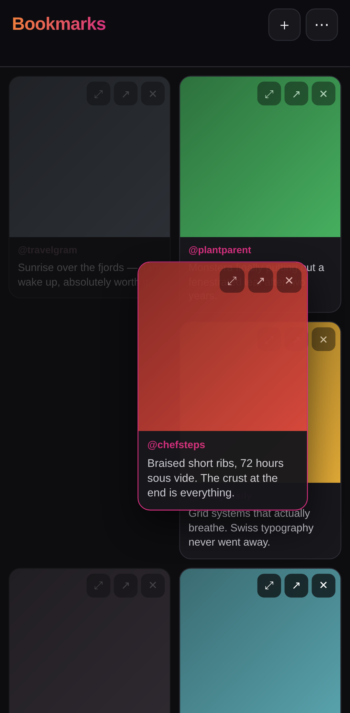

# Instagram Bookmarks

A phone-first web app for keeping your saved Instagram posts in an order that
actually means something to you.

Two gestures do the work:

- **Tap** a post to dim it — a soft de-prioritize. It stays in place, still
  recognisable, just pushed into the background. Tap again to bring it back.
- **Hold and drag** a post to move it anywhere in the grid. The order is yours
  and it sticks.

Install it to your home screen and it runs like a native app.

| Dimmed posts recede | Hold and drag to reorder |
| --- | --- |
|  |  |

*(Screenshots use placeholder content — Instagram previews can't be fetched
without a logged-in session. See below.)*

## Read this first: what Instagram allows

**Instagram has no public API for saved posts.** Meta's Graph API can reach your
own media, comments and mentions, but the Saved tab is not exposed to
third-party apps by any means. No app — this one included — can silently sync
your bookmarks.

So posts get in one of two ways:

1. **Paste or share a link.** Add a post by URL, or share it to the app from
   Instagram (Android share sheet; on iOS use Share → Copy Link, then paste).
2. **Import an Instagram data export.** Instagram → Settings → *Your activity* →
   *Download your information*. When the export arrives, upload its
   `saved_posts.json` (or `.html`) and the whole list loads at once.

A second consequence: **previews are best effort.** The app tries Meta's oEmbed
endpoint and then the post's public Open Graph tags, but Instagram serves a
login wall to logged-out clients much of the time, and private posts never have
public previews. When a preview can't be fetched the bookmark is still saved —
it just shows a placeholder and a link out. Nothing is lost.

When a thumbnail *is* fetched, the image bytes are copied to local disk rather
than hotlinked, because Instagram's CDN URLs are signed and expire within days.
Your library keeps working after they do.

## Running it

```bash
node instagram-bookmarks/server.js
# → http://localhost:4000
```

or `npm run bookmarks`. Node ≥ 18, no dependencies to install.

To use it from your phone, run it on a machine on the same network and visit
`http://<that-machine>:4000`, then **Add to Home Screen**. iOS needs HTTPS for
service workers on a non-localhost origin, so put it behind a reverse proxy with
a certificate if you want full offline support there.

### Optional: better previews

Set `IG_OEMBED_TOKEN` to a Meta app access token with `oembed_read` and the app
will try the official oEmbed endpoint first, which returns cleaner captions and
thumbnails than page scraping.

```bash
IG_OEMBED_TOKEN=... node instagram-bookmarks/server.js
```

### Where your data lives

`instagram-bookmarks/data/bookmarks.json`, with thumbnails alongside it in
`data/media/`. Plain JSON, in display order, meant to be readable and easy to
back up. It is gitignored.

Point `IG_BOOKMARKS_DATA` somewhere else to keep it in a synced folder:

```bash
IG_BOOKMARKS_DATA=~/Dropbox/bookmarks node instagram-bookmarks/server.js
```

## Using it

| Gesture | What happens |
| --- | --- |
| Tap a card | Dim / undim it |
| Hold, then drag | Move it to a new position |
| ⤢ | Expand the full caption |
| ↗ | Open the post on Instagram |
| ✕ | Remove from this app (your Instagram save is untouched) |
| ＋ | Add a post by link |
| ⋯ | Import an export, undim everything, or export your library |

A short vertical flick scrolls the grid as normal — the drag only engages after
a deliberate hold, so scrolling and reordering never fight. On a desktop browser
no hold is needed; just drag.

## How it fits together

```
instagram-bookmarks/
├── server.js              # HTTP server + JSON API (stdlib only)
├── lib/
│   ├── store.js           # flat-file library; array order == display order
│   ├── metadata.js        # link parsing + best-effort preview fetching
│   └── importer.js        # Meta "Download Your Information" parser
├── public/                # the PWA: index.html, app.js, style.css, sw.js
├── tools/make-icons.js    # generates the app icons
├── test.js               # node --test
└── data/                  # your library (gitignored, created on first run)
```

### API

| Method | Path | Purpose |
| --- | --- | --- |
| `GET` | `/api/bookmarks` | The library, in display order |
| `POST` | `/api/bookmarks` | Add `{url}`; returns `202` while the preview is fetched |
| `PATCH` | `/api/bookmarks/:id` | Set `dimmed`, `caption` or `author` |
| `DELETE` | `/api/bookmarks/:id` | Remove one, and its cached thumbnail |
| `POST` | `/api/bookmarks/:id/move` | Move to `{index}` |
| `POST` | `/api/bookmarks/:id/refresh` | Retry the preview fetch |
| `POST` | `/api/reorder` | Apply a whole ordering by `{ids}` |
| `POST` | `/api/import` | Upload an export file body |

The API is deliberately plain so a native client could be built against the same
backend later without changing anything here.

## Tests

```bash
npm run bookmarks:test
```

Covers link parsing, the importer against real export shapes (including Meta's
mojibake), ordering semantics, and the HTTP surface. The gestures themselves
were verified separately in a touch-emulating browser: tap-to-dim, hold-to-drag
reordering, persistence across reloads, and that an ordinary scroll is never
mistaken for either one.

## Notes

- Reordering is a plain splice on a list, so a stale client can never drop a
  bookmark; `POST /api/reorder` appends any id it wasn't told about rather than
  discarding it.
- If `bookmarks.json` is ever unreadable it is moved aside, not overwritten, and
  the path is printed so you can recover it.
- Removing a bookmark here does nothing to your Instagram account.
